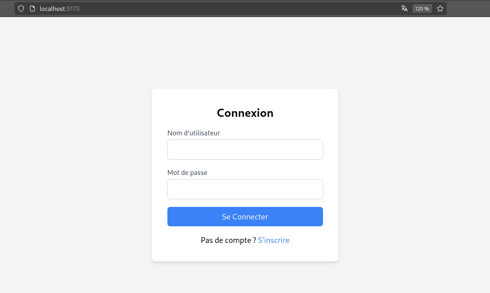

## HackerNewsApplication
Cette application est un projet Spring Boot utilisant Java 17. Elle s'appuie sur deux bases de données : PostgreSQL et ClickHouse. L'objectif principal est de manipuler et d'afficher des données extraites de ces bases de données via une architecture trois tiers (Controller, Service, DAO).

### Fonctionnalités principales
- Gestion d'utilisateur avec authentification en basic.
- Afficher un tableau d'articles de Hacker News et des graphes synthèses statistiques sur ces données en se servant de clickhouse.

## Origine des Données
1. **PostgreSQL** :
    - Table `hacker_news` : Contient les informations sur les articles Hacker News.
    - Table `user` : Gère les informations utilisateur.
2. **ClickHouse** :
    - Réplique des données de PostgreSQL via des tables matérialisées.

    
## Partie Technique

### Architecture
L'application suit une architecture trois tiers :
- **Controller** : Gère les requêtes HTTP et renvoie les réponses.
- **Service** : Contient la logique métier.
- **DAO** : Accès direct aux bases de données.


### Prérequis
Avant de commencer, assurez-vous que votre machine dispose des éléments suivants :

#### Backend
- **Java Development Kit (JDK) 17** : Assurez-vous que JDK 17 est installé.
- **Apache Maven 3.8.7** : Outil de gestion de projets pour construire et gérer le backend.
- **Docker** : Plateforme de conteneurisation nécessaire pour exécuter les services backend.
- **Docker Compose** : Outil pour définir et gérer les conteneurs multi-services.

#### Frontend
- **Node.js 20.x** : Environnement d'exécution JavaScript nécessaire pour exécuter le frontend.
- **npm** : Gestionnaire de paquets Node.js, inclus avec Node.js.

### Lancement de l'application
1. Cloner le projet :
   ```bash
   git clone https://github.com/TherenceEspoir/hacker_news.git
   cd hacker_news
   ```
2. Lancer les conteneurs Docker de base de données :
   ```bash
   docker compose up -d
   ```
3. Construire l'application :
   ```bash
   mvn clean install
   ```
4. Lancer l'application Spring Boot :
   ```bash
   mvn spring-boot:run
   ```
5. lancement du frontend :
   ```bash
   git clone https://github.com/TherenceEspoir/hackerNewsFront
   cd hackerNewsFront
   npm install 
   npm run dev
   ```
6. S'inscrire via un username + mot de passe => se connecter 

## N-tiers du Backend


## Vue de l'application



